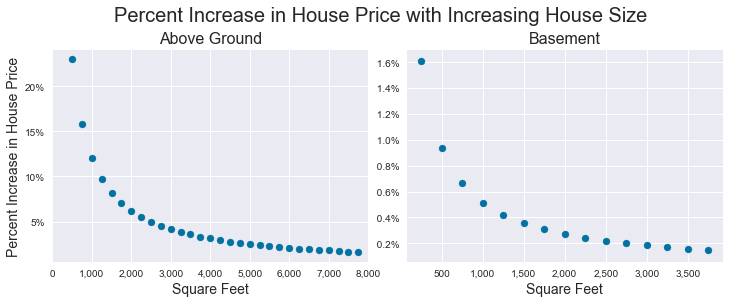
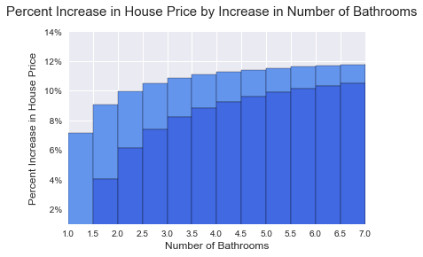

# Phase 2 Project

King County House Sales Linear Regression Model

### Business Problem

Seattle is the fastest growing city in the country with a population increase of almost 30% from 2010 to 2020. The surrounding King County ranks 3rd in the country for growth with a population increase of 16% in the same timeframe. All this growth has increased demand for housing and caused home prices to skyrocket. The median house price in Seattle rose 93% from 2012-2018.

This is a difficult market for home buyers, so this project will help buyers decide what trade-offs are worthwhile to find the best house for their needs in their price range.

### Method

I used Scikit Learn to build a multilinnear regression model to predict house prices using the King County House Sales dataset. I also used a dataset of King County zipcodes and median incomes from Communities Count- a King County population dashboard to investigate the roll of median household income on the effect of zipcodes in determining house prices.

### Conclusions

In building this model, I determined that zipcode is the most important feature in determining a the price of a home. If you would like to have Bill Gates and Jeff Bezos as neighbors, you can expect to pay 135% more for home, compared to similar homes in the mean neighborhoods. Suburbs to the south of Seattle offer have prices 30% lower than similar homes in the mean neighborhoods. 

After zipcode, the square footage of a home the next largest impact on home price, with the above ground space having a much larger impact on home price than basement size. 

Finally, the number of bathrooms can significantly increase home prices, especially in the jump from 1 to 2 bathrooms.

## Getting Started

Start on this project by forking and cloning [this project repository](https://github.com/learn-co-curriculum/dsc-phase-2-project) to get a local copy of the dataset.

We recommend structuring your project repository similar to the structure in [the Phase 1 Project Template](https://github.com/learn-co-curriculum/dsc-project-template). You can do this either by creating a new fork of that repository to work in or by building a new repository from scratch that mimics that structure.

## Project Submission and Review

Review the "Project Submission & Review" page in the "Milestones Instructions" topic to learn how to submit your project and how it will be reviewed. Your project must pass review for you to progress to the next Phase.

## Summary

This project will give you a valuable opportunity to develop your data science skills using real-world data. The end-of-phase projects are a critical part of the program because they give you a chance to bring together all the skills you've learned, apply them to realistic projects for a business stakeholder, practice communication skills, and get feedback to help you improve. You've got this!
