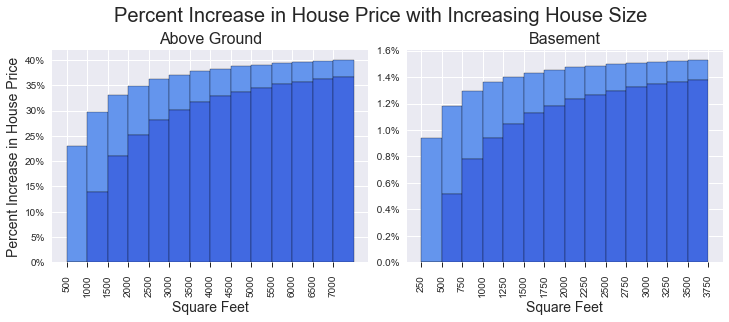

# King County House Sales Linear Regression Model

### Business Problem

Seattle is the fastest growing city in the country with a population increase of almost 30% from 2010 to 2020. The surrounding King County ranks 3rd in the country for growth with a population increase of 16% in the same timeframe. All this growth has increased demand for housing and caused home prices to skyrocket. The median house price in Seattle rose 93% from 2012-2018.

This is a difficult market for home buyers, so this project will help buyers decide what trade-offs are worthwhile to find the best house for their needs in their price range.

### Method

I used Scikit Learn to build a multilinnear regression model to predict house prices using the King County House Sales dataset. I also used a dataset of King County zipcodes and median incomes from Communities Count- a King County population dashboard to investigate the roll of median household income on the effect of zipcodes in determining house prices.

### Results

In building this model, I determined that zipcode is the most important feature in determining a the price of a home. 

Unsuprisingly, the zipcode with the largest impact on house prices, 98039 (middle of map in magenta), is home to Steve Ballmer, Bill Gates and Jeff Bezos. Living in their zipcode will increase the cost of a house by 135% compared to a similar house in the average neighborhood. The most expensive zipcodes cross Seattle proper just north of downtown, then prices gradually decrease as you go outward in both directions, with north Seattle and suburbs more expensive than sounth Seattle and suburbs. Zipcode has little influence on home price in the downtown core and just to the south. The zipcodes with the most negative impact on price are mostly suburbs to the south of Seattle.

After zipcode, the square footage of a home the next largest impact on home price, with the above ground space having a much larger impact on home price than basement size. Additionally, it seems that any price difference that comes from additional bedrooms is due to the increase in size, not the number of bedrooms. The prices increase by a percent of the home's base price for each additional squarefoot. The biggest percent increases happen when the house is small and adding space, but the total dollars increase may be bigger with larger houses. For instance a \$300,000 500sqft home would increase in price by 12% or \$36,000 if increased in size by 500sqft, whereas a \$1,000,000 2000sqft house would increase in price by 4% or \$40,000 if increased in size by 500sqft.

Finally, the number of bathrooms can significantly increase home prices, especially in the jump from 1 to 2 bathrooms.

### Conclusions

Home buyers in this market who are looking to maximize their dollars should carefully consider the locations in which they search. This will make the biggest impact on how far their budget will go. The second most important factor in housing is the square footage of the house. If they have a particular size house in mind, they could maximize space per dollar by looking for a house with a large basement, as basement space is much less expensive than above ground space. King County, and Seattle in particular, are very hilly, so they might look for a daylight basement to get the extra, less expensive space without the darkness associated with a typical basement. Finally, if the buyers are set on two or three bathrooms, it would be worth finding a one bathroom house with space to add more themselves.

This model can account for 85% of the variability in house prices in King County, which is a 10% increase from my initial model. I think the model is a decent start, but could be improved by doing more to work out the best transformation method for each feature. Additionally, I would like to try different scaling methods.

Zipcode has an outsized effect on the model, so I would like to explore other aspects of zipcode to see what might contribute to the effect. Perhaps building a model for each zipcode would be a way to keep the zipcode from having too much influence on the model.

Seattle's population growth and corresponding demand for housing has lead to a change in zoning laws that allow "Accesory Dwelling Units" to be built on lots already having a main house. It would be interesting to see how these additional units will impact the value of homes with and without them. It seems like additional space would increase value, but perhaps the exclusivity factor of having a private yard will also play a role in pricing.

The next step for this model is to build out an application that will allow buyers to use sliders to change house features- location, bathrooms, square footage, etc- and see the effect those changes have on house price.

This analysis would benefit from more recent data and as well as the previously mentioned more fine tuning of the data. Overall, it does a decent job of predicting house prices in King County in the years 2014 & 2015.
